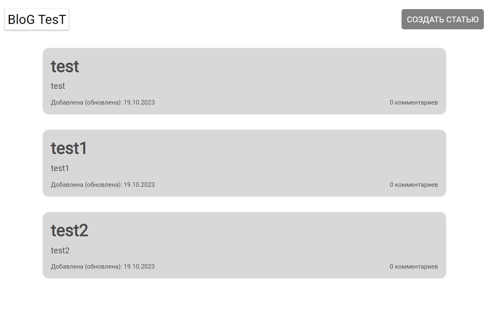
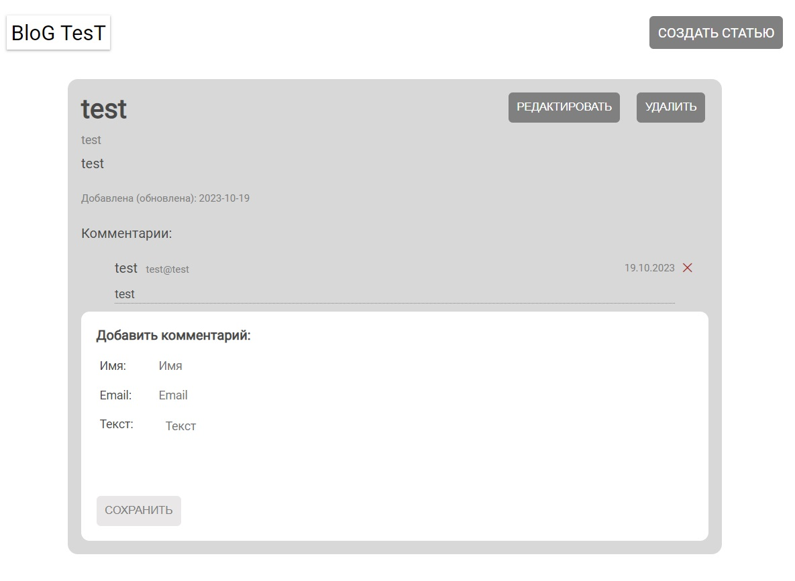
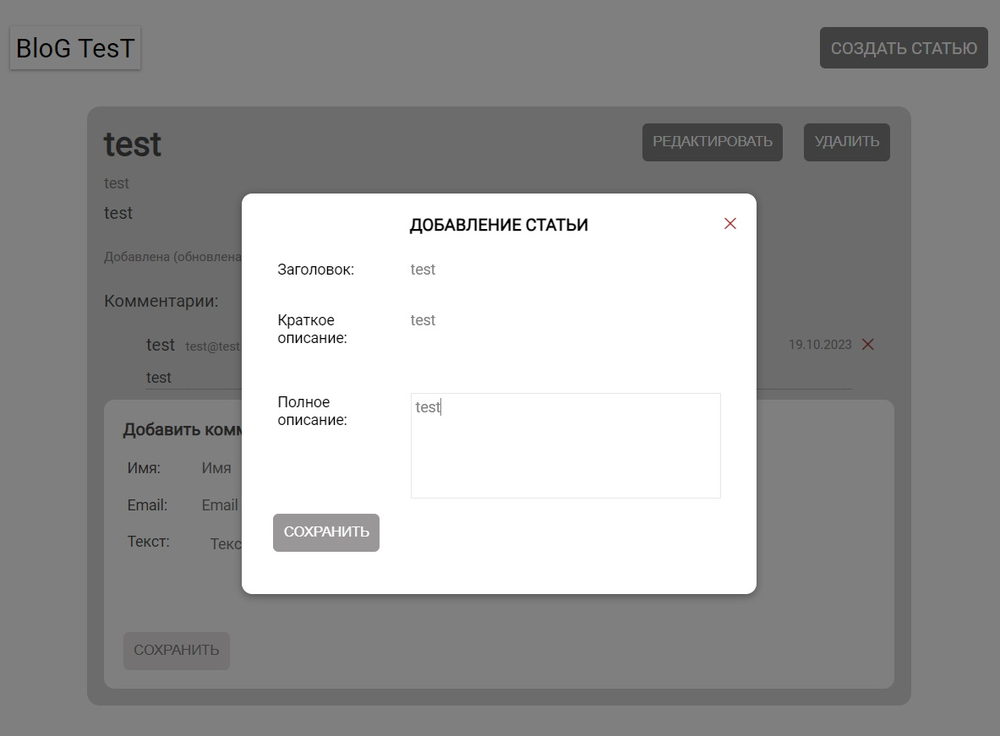

# blog-test-vue

Средствами Vue (не использовать TypeScript) разработать клиентскую часть SPA веб-приложения для ведения личного мини-блога. 
Приложение должно позволять пользователю создавать новые записи в блоге и оставлять комментарии к существующим записям.

